# 🏠 Family Chore Chart

A fun, gamified chore management app for families. Kids earn stars for completing chores, track their progress on leaderboards, and redeem rewards. Perfect for wall-mounted tablets or any device.


## ✨ Features

### 📋 Chore Management
- Create and manage chores with custom icons
- Weekly schedule with day-by-day assignments
- Assign chores to multiple family members
- Track completion history

### ⭐ Gamification
- Earn stars for completing chores
- Bonus tasks for extra stars
- Family leaderboard
- Achievement tracking

### 🏃 Fitness Tracking
- Log family activities with a POS-style picker
- 15+ activity types (bike, run, swim, sports, yoga, etc.)
- Weekly progress tracking toward family goals
- Streak tracking for consecutive active days
- Per-member activity leaderboard
- Admin-manageable activity types

### 🍽️ Dinner Planning
- Weekly meal planner
- Import recipes from any URL (auto-extracts ingredients & instructions)
- Search the web for new recipes
- Recipe collection with prep/cook times

### 🌤️ Weather
- Current conditions with detailed stats
- Hourly forecast
- 7-day forecast
- UV index, humidity, wind, sunrise/sunset

### 📅 Calendar Integration
- View upcoming events
- Syncs with external calendars

### 🖥️ Kiosk Mode
- Beautiful idle screen with clock, weather, and today's dinner
- Auto-sleep after inactivity
- Tap to wake
- Perfect for wall-mounted tablets

### 🤖 AI Assistant
- Voice-enabled assistant integration
- Natural language interaction

## 🛠️ Tech Stack

- **Frontend:** React 18, TypeScript, Vite
- **UI Library:** [Mantine](https://mantine.dev/) v7
- **Icons:** [Tabler Icons](https://tabler.io/icons)
- **Backend:** Express.js
- **Database:** PostgreSQL
- **Weather:** Open-Meteo API (free, no key required)

## 🚀 Quick Start

### Prerequisites

- Node.js 18+
- PostgreSQL 14+
- npm or pnpm

### 1. Clone the Repository

```bash
git clone https://github.com/GiantsbaneDDC/family-chore-chart.git
cd family-chore-chart
```

### 2. Install Dependencies

```bash
# Frontend
npm install

# Backend
cd server
npm install
cd ..
```

### 3. Set Up Database

```bash
# Create database and user
sudo -u postgres psql << EOF
CREATE DATABASE chorechart;
CREATE USER chorechart WITH PASSWORD 'chorechart';
GRANT ALL PRIVILEGES ON DATABASE chorechart TO chorechart;
ALTER DATABASE chorechart OWNER TO chorechart;
\c chorechart
GRANT ALL ON SCHEMA public TO chorechart;
EOF

# Run migrations
sudo -u postgres psql -d chorechart -f server/setup-db.sql
sudo -u postgres psql -d chorechart -f server/migrate-dinner-plan.sql
sudo -u postgres psql -d chorechart -f server/migrate-source-url.sql
sudo -u postgres psql -d chorechart -f server/migrate-fitness.sql
```

### 4. Configure Environment

Create `server/.env`:

```env
DB_HOST=localhost
DB_PORT=5432
DB_NAME=chorechart
DB_USER=chorechart
DB_PASSWORD=chorechart
PORT=8080
SESSION_SECRET=your-secret-key-change-this
```

### 5. Build & Run

```bash
# Build frontend
npm run build

# Start server
cd server
node index.js
```

### 6. Open the App

Visit **http://localhost:8080**

## 📱 First Steps

1. **Access Admin Panel** - Click the ⚙️ icon, enter PIN `1234` (default)
2. **Add Family Members** - Go to Family tab, add names with avatars and PINs
3. **Create Chores** - Go to Chores tab, add your household chores
4. **Set Up Schedule** - Go to Schedule tab, assign chores to days/people
5. **Plan Dinners** - Go to Dinner Plan, search and import recipes
6. **Track Fitness** - Use the Fitness tab to log family activities

## 🖼️ Screenshots

### Main Views

| Home | Chores | Fitness |
|:---:|:---:|:---:|
| 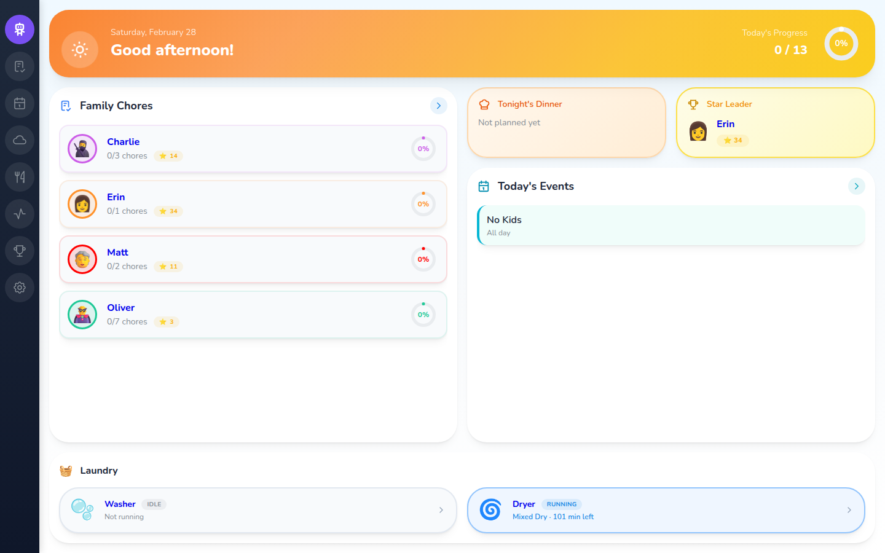 |  | 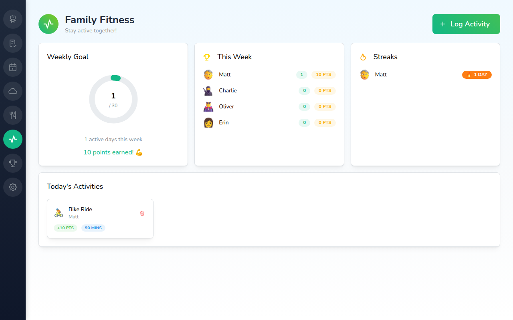 |

| Weather | Dinner Plan | Rewards |
|:---:|:---:|:---:|
| 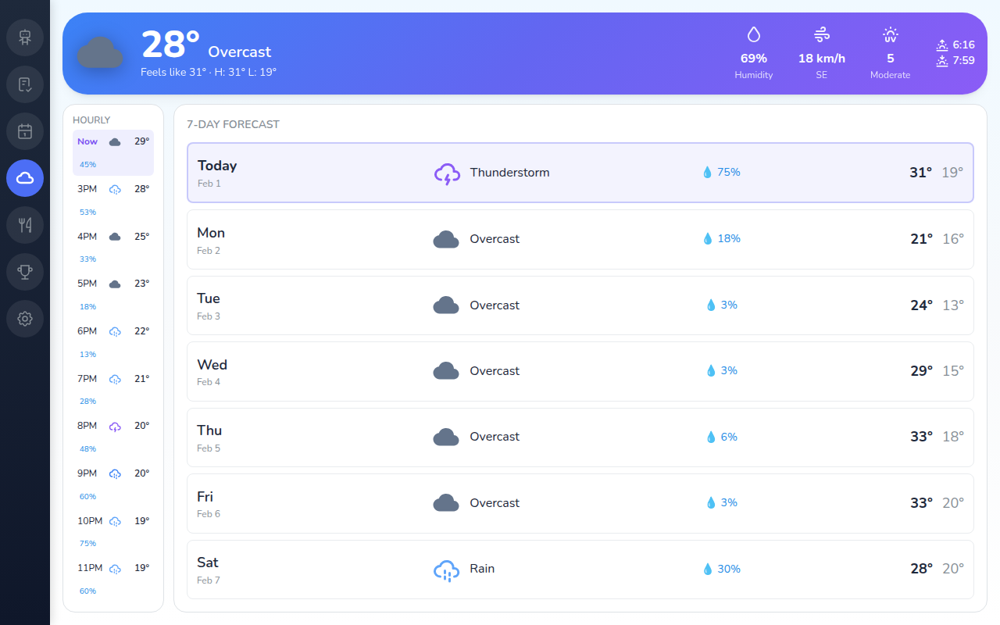 | 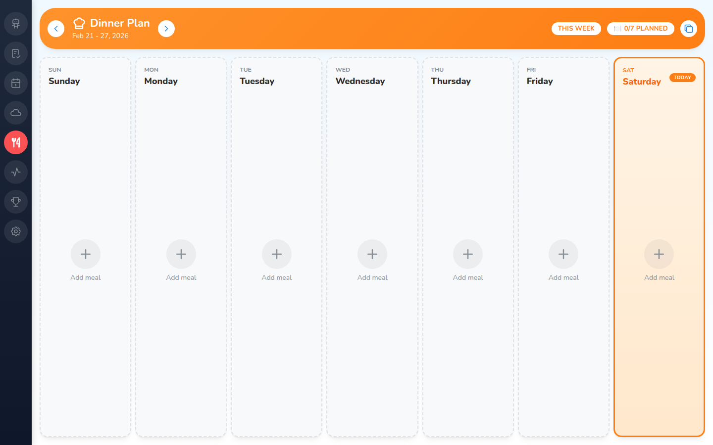 | 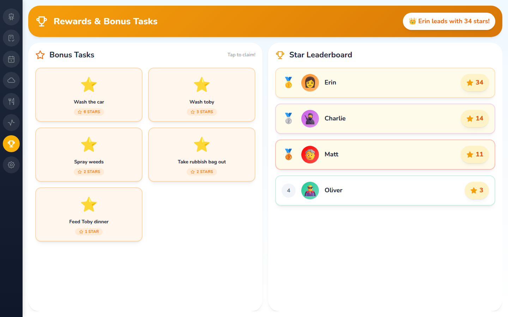 |

| Calendar | Recipe |
|:---:|:---:|
| 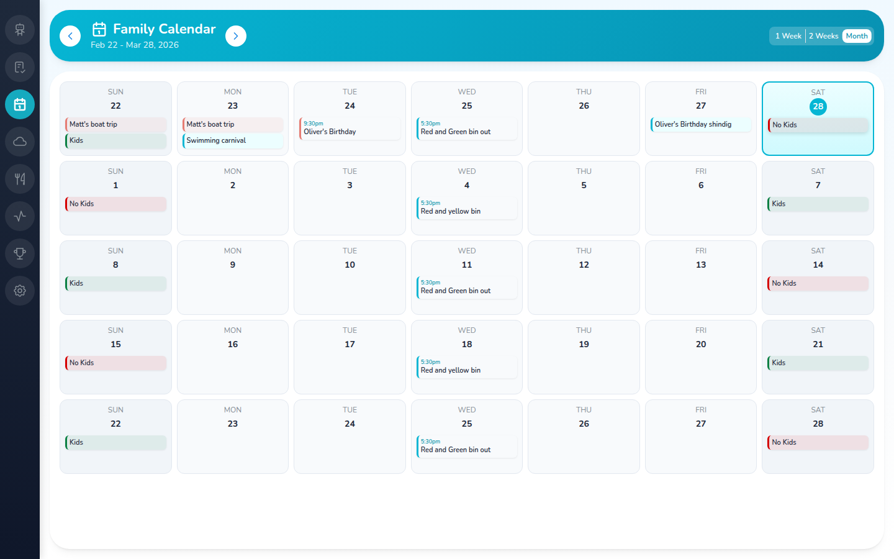 | 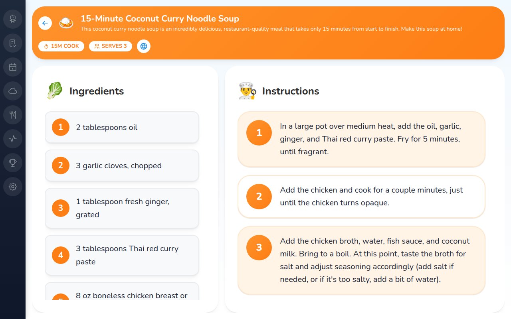 |

### Kiosk Mode (POS-Style Pickers)

| Member Select | Chore Picker |
|:---:|:---:|
|  | 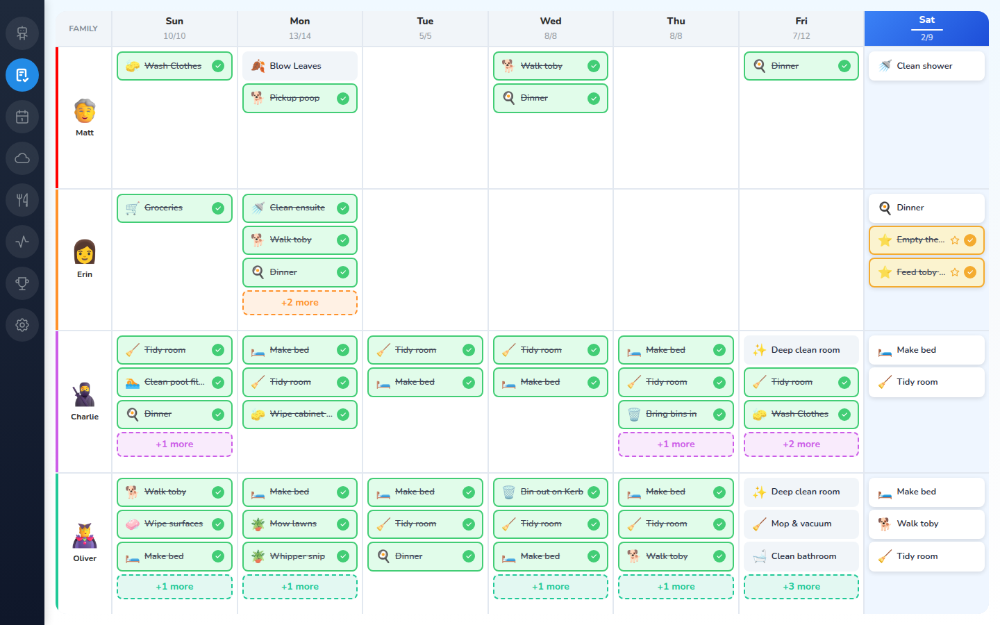 |

| Fitness - Select Member | Fitness - Activity Picker |
|:---:|:---:|
| 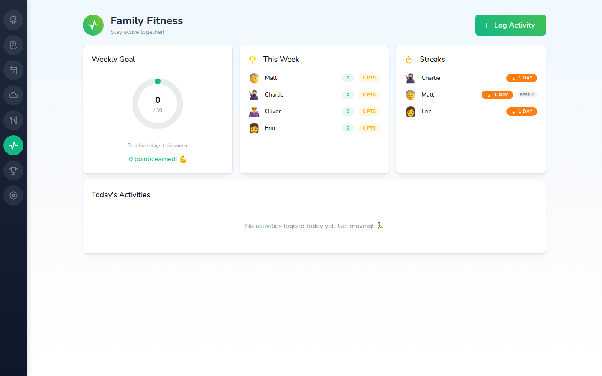 | 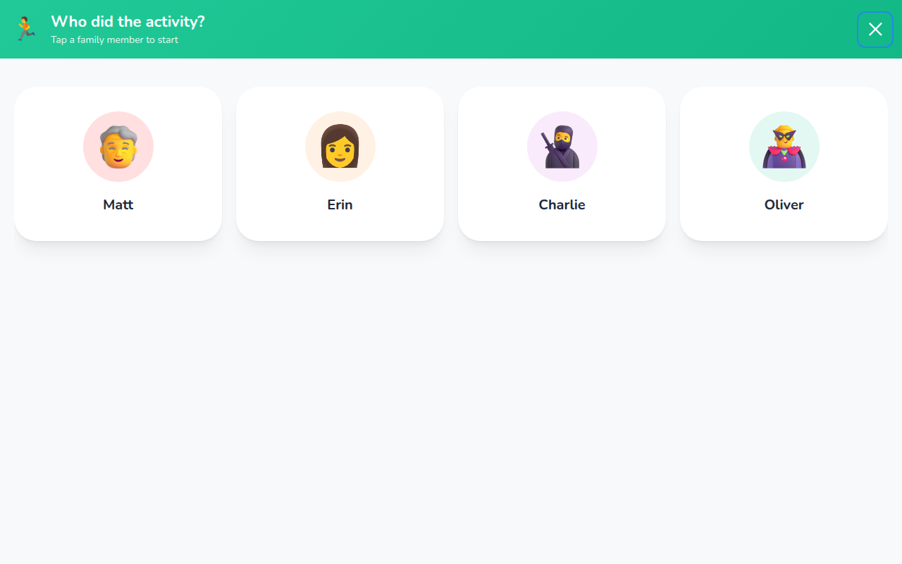 |

### Admin Panel

| Members | Chores | Activities |
|:---:|:---:|:---:|
| 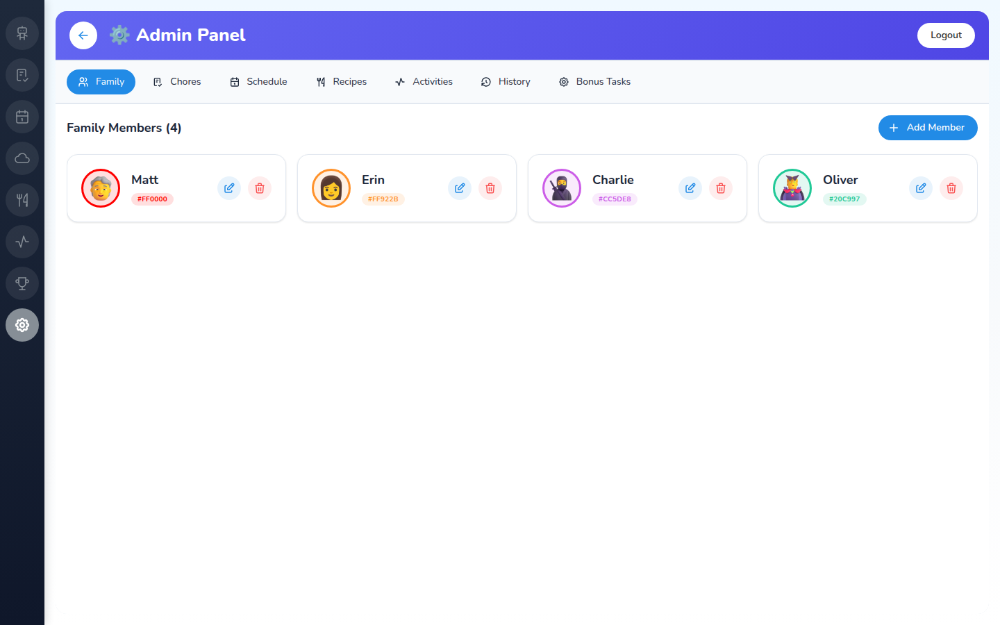 | 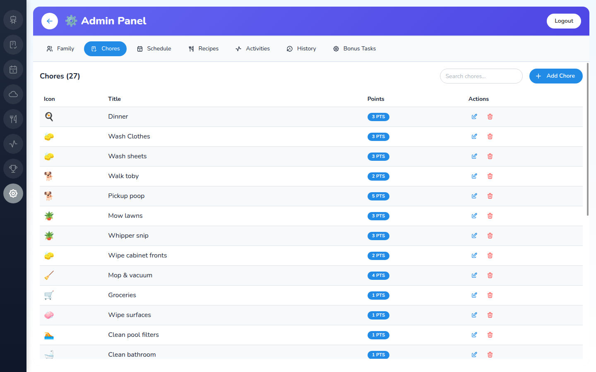 | 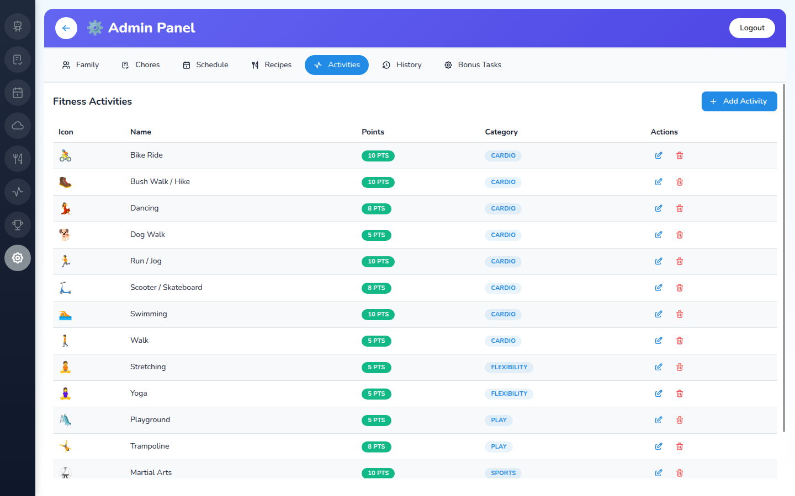 |

| Rewards | Recipes |
|:---:|:---:|
|  |  |

## 📁 Project Structure

```
family-chore-chart/
├── src/                    # Frontend source
│   ├── components/         # Reusable components
│   ├── views/              # Page components
│   ├── api.ts              # API client
│   └── types.ts            # TypeScript types
├── server/                 # Backend source
│   ├── index.js            # Express server
│   └── *.sql               # Database migrations
├── public/                 # Static assets
└── dist/                   # Production build
```

## 🔧 Development

```bash
# Run frontend dev server (hot reload)
npm run dev

# Run backend (separate terminal)
cd server && node index.js
```

Frontend dev server runs on `http://localhost:5173` with HMR.

## 📄 License

MIT

## 🙏 Acknowledgments

- [Mantine](https://mantine.dev/) - Beautiful React components
- [Tabler Icons](https://tabler.io/icons) - High-quality icons
- [Open-Meteo](https://open-meteo.com/) - Free weather API
